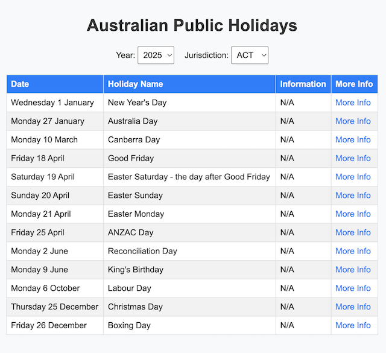

# 🇦🇺 Australian Public Holidays Viewer

A simple project by **Yasith Lokuge** with Vibe Coding to display and explore **Australian public holidays** using the open dataset from [data.gov.au](https://data.gov.au/).

This repository contains:
- A **standalone HTML page** (`index.html`) that fetches and displays the holidays in a browser.
- A **Chrome Extension** (`/extension`) that provides the same functionality directly inside your browser toolbar popup.

---

## 📁 Project Structure

```
australian-public-holidays
├── extension
│		├── manifest.json
│		├── popup.css
│		├── popup.html
│		├── popup.js
│		└── README.md
├── favicon
│		├── android-chrome-192x192.png
│		├── android-chrome-512x512.png
│		├── apple-touch-icon.png
│		├── favicon-16x16.png
│		├── favicon-32x32.png
│		└── favicon.ico
├── index.html
├── LICENSE.md
├── README.md
├── robots.txt
├── Screenshot.png
└── sitemap.xml
```

---

## 🌐 Live HTML Page

### File
`index.html`

### Description
A simple, self-contained webpage that:
- Fetches holiday data from:
  ```
  https://data.gov.au/data/api/action/datastore_search?resource_id=33673aca-0857-42e5-b8f0-9981b4755686
  ```
- Displays a table of:
  - **Date** (formatted as `Wednesday 1 January`)
  - **Holiday Name**
  - **Information**
  - **More Info** (link)
- Includes filters for:
  - **Year**
  - **Jurisdiction**

### Features
✅ No dependencies — pure HTML, CSS, and JS  
✅ Handles `null` or missing data fields gracefully  
✅ Responsive and simple design  

### How to Run
Just open `index.html` in any modern web browser.

---

## 🧩 Chrome Extension

### Folder
`/extension`

### Description
A Chrome extension that fetches and displays the same Australian public holiday data inside a convenient browser popup.

### Features
- Instant access to holidays right from your browser toolbar
- Filter by **Year** and **Jurisdiction**
- Displays date in friendly `Wednesday 1 January` format
- Built with **Manifest V3**
- Uses `data.gov.au` API directly (no backend needed)

### Permissions
```json
"host_permissions": [
  "https://data.gov.au/*"
]
```

### Installation (Developer Mode)
1. Open Chrome and navigate to:  
   `chrome://extensions`
2. Enable **Developer Mode** (top-right toggle)
3. Click **Load unpacked**
4. Select the `extension` folder inside this repository
5. The extension icon will appear in your toolbar — click it to open the popup

---

## 📜 License
See [LICENSE.md](LICENSE.md) for full license details.

---

## 🧠 Credits
Created with 💡 and ☕ by **Yasith Lokuge with Vibe Coding**  
Powered by open data from [data.gov.au](https://data.gov.au/)
Inspired by [nextpoyawhen.com](https://nextpoyawhen.com)
---

## 📸 Screenshot

---

[](LICENSE.md)
Licensed under the **MIT License © 2025 Yasith Lokuge**
